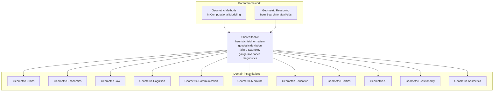

# Geometric Economics: Decision Manifolds, Equilibria, and the Geometry of Markets

**Andrew H. Bond**
Senior Member, IEEE | San Jose State University

---

## Part of the Geometric Series

This book is a domain instantiation of the general framework developed in:

- **Geometric Methods in Computational Modeling** (Bond, 2026a) — the mathematical toolkit
- **Geometric Reasoning: From Search to Manifolds** (Bond, 2026c) — the parent theory

It inherits the heuristic field formalism, geodesic deviation measure, failure taxonomy, gauge invariance diagnostics, and engineering toolkit from the parent text, and instantiates them on a domain-specific manifold.

## Status

Outline stage. See `BOOK_PLAN.md` for the chapter plan.

## Series map

## The Geometric Series

| Book | Status |
|------|--------|
| [Geometric Methods](https://github.com/ahb-sjsu/agi-hpc) | Published |
| [Geometric Reasoning](https://github.com/ahb-sjsu/geometric-reasoning) | Draft complete |
| [Geometric Ethics](https://github.com/ahb-sjsu/geometric-ethics) | Published (v1.23) |
| **Geometric Economics: Decision Manifolds, Equilibria, and the Geometry of Markets** | **Outline** |
| [Geometric Law](https://github.com/ahb-sjsu/geometric-law) | Outline |
| [Geometric Cognition](https://github.com/ahb-sjsu/geometric-cognition) | Outline |
| [Geometric Communication](https://github.com/ahb-sjsu/geometric-communication) | Outline |
| [Geometric Medicine](https://github.com/ahb-sjsu/geometric-medicine) | Outline |
| [Geometric Aesthetics](https://github.com/ahb-sjsu/geometric-aesthetics) | Paper complete, book drafting |

## License

MIT
